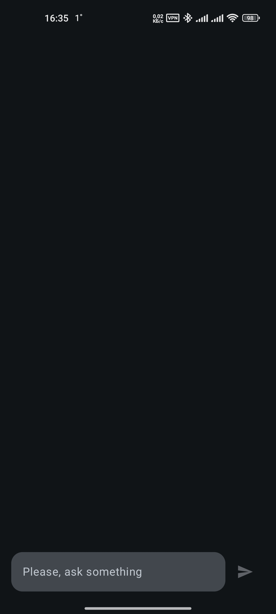
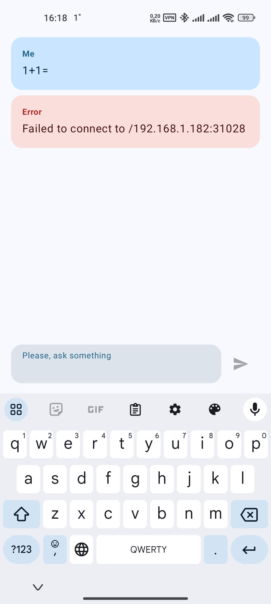
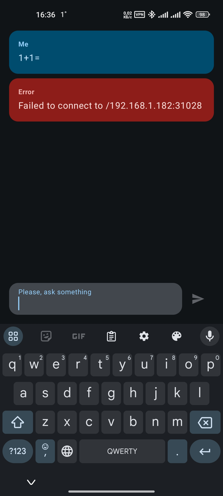
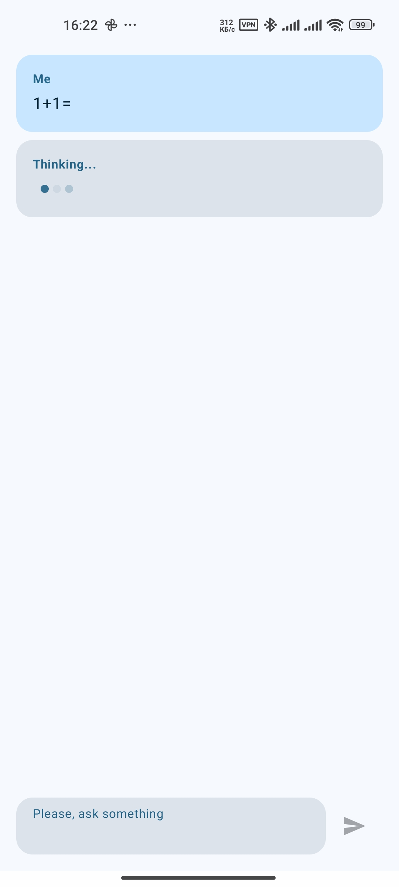
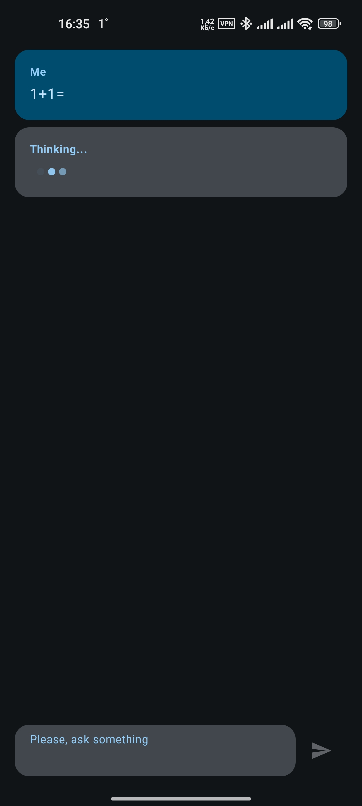
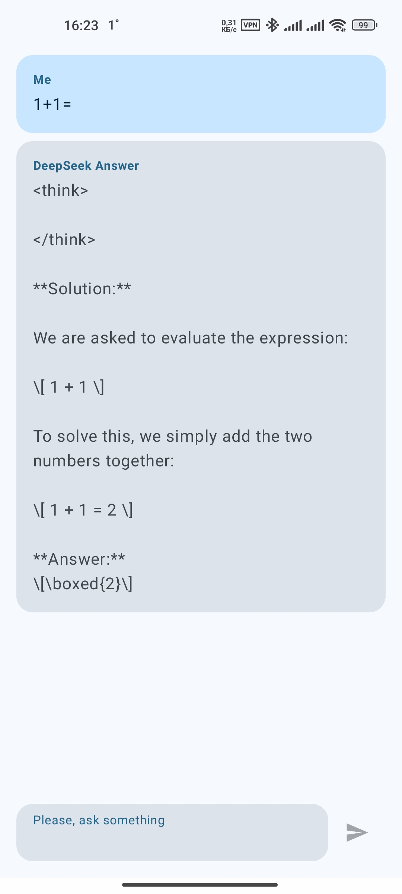
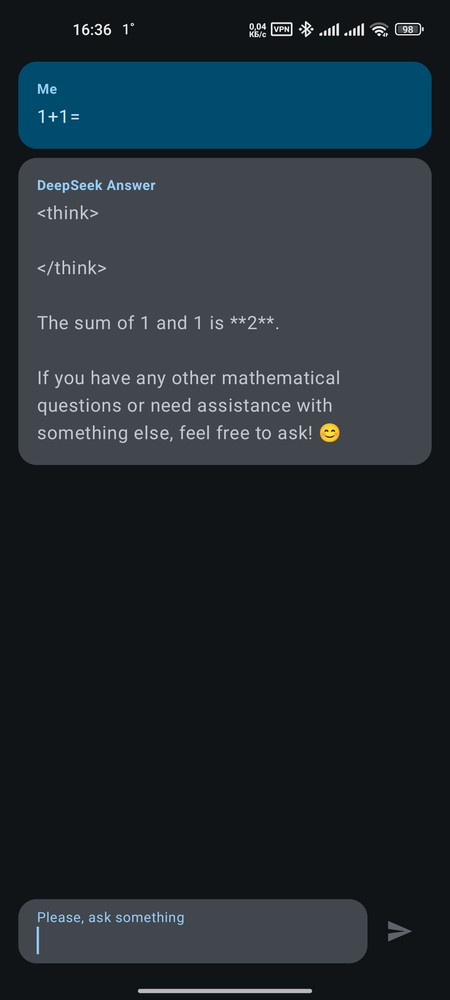

# 🤖 Llama3.2 Local ChatBot Android App

[](https://developer.android.com/about/versions/android-13)
[](https://kotlinlang.org/)
[](https://developer.android.com/jetpack/compose)
[](LICENSE)

A modern Android application that provides a chat interface to interact with local Llama3.2 AI models through Ollama. Built with Jetpack Compose and Material Design 3, this app offers a seamless chat experience with your local AI assistant.

## ✨ Features

- **🤖 Local AI Chat**: Interact with Llama3.2 models running locally via Ollama
- **🎨 Modern UI**: Beautiful Material Design 3 interface with Jetpack Compose
- **🌙 Dark/Light Theme**: Automatic theme switching based on system preferences
- **💬 Real-time Chat**: Send messages and receive AI responses in real-time
- **📱 Responsive Design**: Optimized for various screen sizes and orientations
- **⚡ Fast & Lightweight**: Minimal dependencies and efficient networking
- **🔄 Error Handling**: Graceful error handling with user-friendly messages

## 📱 Screenshots

| Screen | Light Mode | Dark Mode |
|--------|------------|-----------|
| **Main Chat** |  |  |
| **Error Handling** |  |  |
| **Thinking State** |  |  |
| **AI Response** |  |  |

## 🚀 Prerequisites

Before running this app, you need to set up:

1. **Ollama Server**: Install and run [Ollama](https://ollama.com/) on your local machine
2. **Llama3.2 Model**: Pull the Llama3.2 model using:
   ```bash
   ollama pull llama3.2
   ```
3. **Network Access**: Ensure your Android device can access the Ollama server (same network or localhost)

## 🛠️ Installation

### Option 1: Download APK
1. Download the latest APK from the [Releases](https://github.com/yourusername/Local-Andriod-Chatbot/releases) page
2. Enable "Install from Unknown Sources" in your Android settings
3. Install the APK file

### Option 2: Build from Source

1. **Clone the repository**
   ```bash
   git clone https://github.com/yourusername/Local-Andriod-Chatbot.git
   cd Local-Andriod-Chatbot
   ```

2. **Open in Android Studio**
   - Open Android Studio
   - Select "Open an existing project"
   - Navigate to the cloned directory and open it

3. **Configure Ollama Server URL**
   - Open `app/src/main/java/com/sinukeapps/chat/mydeepseekchat/MainActivity.kt`
   - Update the `baseUrl` in the Retrofit configuration (line ~75):
   ```kotlin
   .baseUrl("http://YOUR_IP_ADDRESS:11434/")
   ```
   - Replace `YOUR_IP_ADDRESS` with your computer's IP address

4. **Build and Run**
   - Connect your Android device or start an emulator
   - Click "Run" in Android Studio or use:
   ```bash
   ./gradlew assembleDebug
   ```

## ⚙️ Configuration

### Ollama Server Setup

1. **Install Ollama** (if not already installed):
   ```bash
   # macOS/Linux
   curl -fsSL https://ollama.com/install.sh | sh
   
   # Windows
   # Download from https://ollama.com/download
   ```

2. **Start Ollama Server**:
   ```bash
   ollama serve
   ```

3. **Pull Llama3.2 Model**:
   ```bash
   ollama pull llama3.2
   ```

### Network Configuration

- **Same Network**: Use your computer's IP address (e.g., `192.168.1.100`)
- **Local Development**: Use `10.0.2.2` for Android emulator or `localhost` for physical device
- **Port**: Default Ollama port is `11434`

## 🏗️ Architecture

The app follows a clean architecture pattern with the following components:

```
app/src/main/java/com/sinukeapps/chat/mydeepseekchat/
├── MainActivity.kt          # Main activity with UI setup
├── api/
│   └── ChatBotApi.kt       # Retrofit API interface
├── model/
│   ├── ChatBotRequest.kt   # Request data model
│   ├── ChatBotResponse.kt  # Response data model
│   ├── ChatMessage.kt      # Chat message model
│   └── MessageType.kt      # Message type enum
└── ui/
    └── theme/              # Material Design 3 theme
```

## 🛠️ Tech Stack

- **Language**: Kotlin 2.0.0
- **UI Framework**: Jetpack Compose
- **Architecture**: MVVM with Compose
- **Networking**: Retrofit 2.11.0 + OkHttp 4.9.0
- **JSON Parsing**: Gson
- **Minimum SDK**: API 33 (Android 13)
- **Target SDK**: API 35 (Android 15)

## 📋 API Reference

The app communicates with Ollama using the following API:

### Generate Response
```http
POST {host}/api/generate
Content-Type: application/json
```

**Request Body:**
```json
{
  "model": "llama3.2",
  "prompt": "Your message here",
  "stream": false
}
```

**Response:**
```json
{
  "response": "AI generated response",
  "done": true
}
```

## 🐛 Known Issues

- **Screen Rotation**: Some UI issues may occur during device rotation
- **Activity State**: Potential issues with activity lifecycle management
- **Minimum SDK**: Requires Android API 33+ (Android 13)
- **Network Dependency**: Requires active connection to Ollama server

## 🤝 Contributing

Contributions are welcome! Please feel free to submit a Pull Request.

1. Fork the repository
2. Create your feature branch (`git checkout -b feature/AmazingFeature`)
3. Commit your changes (`git commit -m 'Add some AmazingFeature'`)
4. Push to the branch (`git push origin feature/AmazingFeature`)
5. Open a Pull Request

## 📄 License

This project is licensed under the MIT License - see the [LICENSE](LICENSE) file for details.

## 🙏 Acknowledgments

- [Ollama](https://ollama.com/) for providing the local AI server
- [Llama 3](https://llama.meta.com/) for the AI model
- [Jetpack Compose](https://developer.android.com/jetpack/compose) for the modern UI framework
- [Material Design 3](https://m3.material.io/) for the design system

## 📞 Support

If you encounter any issues or have questions:

1. Check the [Issues](https://github.com/yourusername/Local-Andriod-Chatbot/issues) page
2. Create a new issue with detailed information
3. Include your device model, Android version, and error logs

---

⭐ **Star this repository if you find it helpful!**