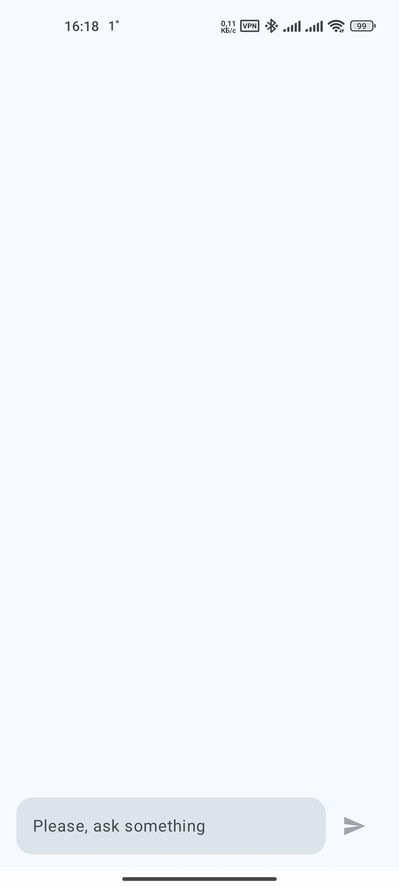

# deepseek-local-chatbot-android-app
## Description

The repository contains a source code for Android application to interact with local DeepSeek model.
The local [ollama](https://ollama.com/) server is used to interact with [DeepSeek R1 model](https://ollama.com/library/deepseek-r1).

The following API is used to generate answers for requests:
`POST {host}/api/generate`

with following body:
```json
{
  "model": "deepseek-r1:8b",
  "stream": false,
  "prompt": "<prompt here>"
}
```
## Knows Issues
It is very simple application generated by Microsoft Copilot with some my changes/updates. The following problems can be faced:
* issues when phone rotates
* issues when application/activity state changes
* twitching when keyboard shows
* minSDK = 33

## Screenshots

| Screen           | Light Mode                                                      | Dark Mode |
|------------------|-----------------------------------------------------------------|-----------|
| Main Screen      |  |           |
| Error Message    |                                                                 |           |
| Thinking Message |                                                                 |           |
| Answer           |                                                                 |           |